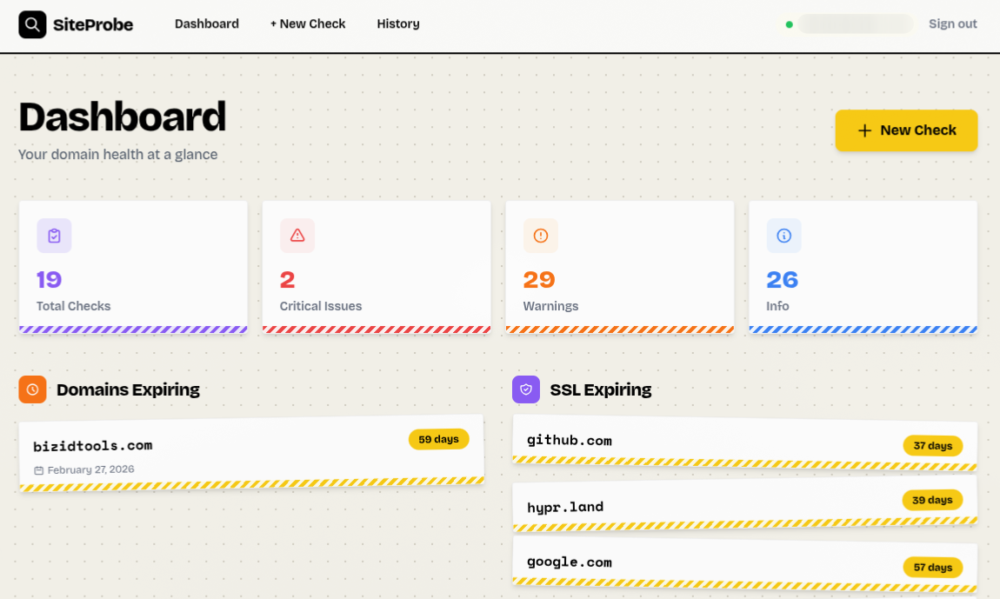
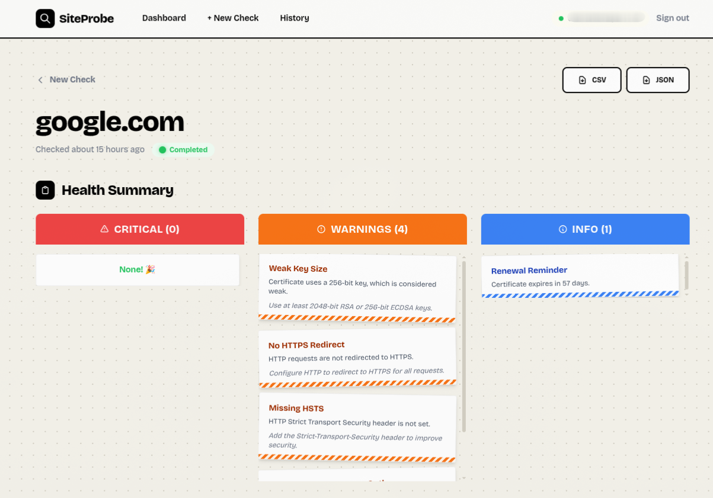
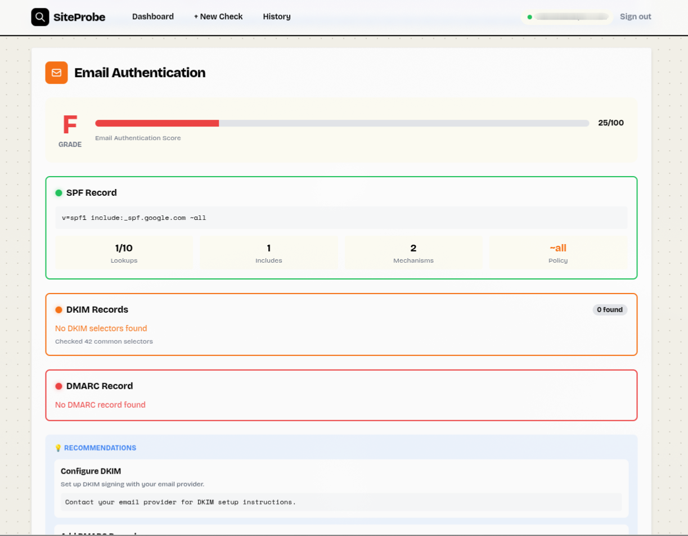

<p align="center">
  
</p>

<h1 align="center">SiteProbe</h1>

<p align="center">
  <strong>Comprehensive Domain Intelligence at Your Fingertips</strong>
</p>

<p align="center">
  <a href="#features">Features</a> •
  <a href="#demo">Demo</a> •
  <a href="#installation">Installation</a> •
  <a href="#usage">Usage</a> •
  <a href="#configuration">Configuration</a> •
  <a href="#contributing">Contributing</a> •
  <a href="#license">License</a>
</p>

<p align="center">
  <!-- Badges -->
  
  
  
</p>

---

## What is SiteProbe?

SiteProbe is a powerful, all-in-one domain analysis tool designed for **developers**, **sysadmins**, and **security researchers** who need quick, actionable insights into any website or domain. Simply enter a domain name and get a comprehensive health report covering everything from DNS configuration to email authentication.

Built with Ruby on Rails 8 and featuring real-time updates via Action Cable, SiteProbe delivers results fast while providing deep technical analysis with clear, prioritized recommendations.

---

## Features

### DNS Analysis
- **Multi-resolver verification** using Google (8.8.8.8) and Cloudflare (1.1.1.1)
- Complete record inspection: A, AAAA, MX, CNAME, NS, TXT
- DNS propagation detection and mismatch alerts
- IPv6 readiness assessment

### WHOIS Intelligence
- Domain registration details and registrar information
- **Expiration monitoring** with tiered alerts (critical/warning/info)
- Creation and last-updated timestamps
- Nameserver enumeration
- Automatic fallback to system WHOIS for resilient lookups

### SSL/TLS Security
- Full certificate chain analysis
- **TLS version auditing** (1.2, 1.3) with deprecated protocol detection
- Certificate expiration tracking with smart warnings
- Key size and signature algorithm validation
- Self-signed certificate detection
- Domain name mismatch alerts

### HTTP Security Headers
- Comprehensive header analysis including:
  - `Strict-Transport-Security` (HSTS) with strength scoring
  - `Content-Security-Policy` (CSP) directive breakdown
  - `X-Frame-Options`, `X-Content-Type-Options`
  - `Referrer-Policy`, `Permissions-Policy`
  - Cross-Origin policies (COOP, CORP, COEP)
- HTTPS redirect verification
- Response time monitoring
- Server information disclosure detection

### Email Authentication Audit
- **SPF** record parsing and policy analysis
- **DKIM** selector discovery and key validation
- **DMARC** policy evaluation with alignment checks
- **Authentication score** (0-100) with letter grades (A-F)
- Cross-protocol consistency checking
- Actionable recommendations for each protocol

### Subdomain Discovery
- Scans 80+ common subdomains (www, mail, api, admin, dev, staging, etc.)
- Categorized results (web, email, admin, development, infrastructure, etc.)
- A record resolution for discovered subdomains

### Real-Time Updates
- Live progress updates via WebSockets (Action Cable)
- No page refresh needed—results stream in as they're discovered

### Export & Feedback
- Export detailed check results
- Built-in feedback system for continuous improvement

---

## Demo


*Dashboard showing recent domain checks*


*Comprehensive analysis results with security recommendations*


*Email authentication audit with letter grade scoring*

---

## Installation

### Prerequisites

- **Ruby** 3.2 or higher
- **SQLite3** (default) or PostgreSQL
- **Node.js** (for asset compilation in development)
- **System WHOIS** command (optional, for fallback lookups)

### Quick Start

1. **Clone the repository**

   ```bash
   git clone https://github.com/ScribeK2/siteprobe.git
   cd siteprobe
   ```

2. **Install dependencies**

   ```bash
   bundle install
   ```

3. **Setup the database**

   ```bash
   bin/rails db:setup
   ```

4. **Start the development server**

   ```bash
   bin/dev
   ```

5. **Open your browser**

   Navigate to [http://localhost:3000](http://localhost:3000)

### Docker Installation

```bash
# Build the image
docker build -t siteprobe .

# Run the container
docker run -p 3000:3000 -e SECRET_KEY_BASE=$(bin/rails secret) siteprobe
```

---

## Usage

### Running a Domain Check

1. Navigate to the dashboard
2. Click **"New Check"** or enter a domain in the search field
3. Enter the target domain (e.g., `example.com`)
4. Optionally enable **subdomain scanning** for deeper reconnaissance
5. Click **"Analyze"** and watch results stream in real-time

### Understanding Results

Results are organized into expandable sections:

| Section | What It Shows |
|---------|---------------|
| **WHOIS** | Registration info, expiry dates, nameservers |
| **DNS** | All DNS records with multi-resolver verification |
| **SSL/TLS** | Certificate details, chain, protocol support |
| **HTTP** | Security headers, redirects, response times |
| **Email** | SPF/DKIM/DMARC with authentication score |
| **Subdomains** | Discovered subdomains (if scan enabled) |

### Issue Severity Levels

SiteProbe categorizes findings into three severity levels:

- **Critical** — Immediate action required (expired certs, domain issues)
- **Warning** — Should be addressed soon (weak configurations)
- **Info** — Best practice recommendations

### CLI Usage (Coming Soon)

```bash
# Future: Command-line interface
bin/siteprobe check example.com --json
bin/siteprobe check example.com --subdomains
```

---

## Configuration

### Environment Variables

| Variable | Description | Default |
|----------|-------------|---------|
| `RAILS_ENV` | Environment (development/production/test) | `development` |
| `SECRET_KEY_BASE` | Rails secret key (required in production) | — |
| `DATABASE_URL` | Database connection string | SQLite (local) |
| `RAILS_SERVE_STATIC_FILES` | Serve static files from Rails | `false` |
| `RAILS_LOG_TO_STDOUT` | Output logs to stdout | `false` |

### Caching

SiteProbe intelligently caches results to improve performance:

| Check Type | Cache Duration |
|------------|----------------|
| WHOIS | 24 hours |
| DNS | 1 hour |
| SSL/TLS | 1 hour |
| HTTP | 1 hour |
| Email Auth | 1 hour |
| Subdomains | 6 hours |

### Background Jobs

Domain checks run asynchronously via **Solid Queue**. Configure workers in `config/queue.yml`:

```yaml
default:
  dispatchers:
    - polling_interval: 1
      batch_size: 500
  workers:
    - queues: "*"
      threads: 3
      polling_interval: 0.1
```

### Recurring Jobs

SSL expiration notifications can be configured in `config/recurring.yml`:

```yaml
production:
  ssl_expiration_check:
    class: ExpirationNotificationJob
    schedule: every day at 9am
```

---

## Tech Stack

| Component | Technology |
|-----------|------------|
| **Framework** | Ruby on Rails 8.1 |
| **Database** | SQLite3 (default) / PostgreSQL |
| **Background Jobs** | Solid Queue |
| **Real-time** | Solid Cable (Action Cable) |
| **Caching** | Solid Cache |
| **Frontend** | Hotwire (Turbo + Stimulus) |
| **CSS** | Tailwind CSS |
| **Authentication** | Devise |
| **Deployment** | Kamal / Docker |

---

## Project Structure

```
siteprobe/
├── app/
│   ├── controllers/      # HTTP request handling
│   ├── jobs/             # Background job processors
│   ├── models/           # Domain models
│   ├── services/         # Core checking logic
│   │   ├── dkim_checker.rb
│   │   ├── dmarc_checker.rb
│   │   ├── dns_checker.rb
│   │   ├── domain_checker.rb    # Main orchestrator
│   │   ├── email_checker.rb
│   │   ├── http_checker.rb
│   │   ├── spf_checker.rb
│   │   ├── ssl_checker.rb
│   │   ├── subdomain_scanner.rb
│   │   └── whois_checker.rb
│   └── views/            # UI templates
├── config/               # Rails configuration
├── db/                   # Database schema & migrations
└── test/                 # Test suite
```

---

## Roadmap

SiteProbe is currently at **MVP stage**. Here's what's planned:

- [ ] **CLI Interface** — Run checks from the command line
- [ ] **API Endpoints** — RESTful API for integrations
- [ ] **Scheduled Monitoring** — Automatic recurring checks
- [ ] **Alerting** — Email/Slack notifications for issues
- [ ] **Bulk Checks** — Analyze multiple domains at once
- [ ] **Historical Tracking** — Track changes over time
- [ ] **PDF Reports** — Exportable PDF security reports
- [ ] **Browser Extension** — Quick checks while browsing

---

## Contributing

Contributions are what make the open-source community amazing! Any contributions you make are **greatly appreciated**.

### Code Style

This project uses [RuboCop Rails Omakase](https://github.com/rails/rubocop-rails-omakase) for Ruby style guidelines.

## Testing

```bash
# Run all tests
bin/rails test

# Run specific test file
bin/rails test test/services/ssl_checker_test.rb

# Run with coverage
COVERAGE=true bin/rails test
```

---

## Deployment

### Using Kamal (Recommended)

```bash
# Setup Kamal
kamal setup

# Deploy
kamal deploy
```

### Using Docker

```bash
docker build -t siteprobe .
docker run -d -p 3000:3000 \
  -e SECRET_KEY_BASE=your-secret-key \
  -e RAILS_ENV=production \
  siteprobe
```

---

## Acknowledgments

- [Whois gem](https://github.com/weppos/whois) — Ruby WHOIS client
- [Dnsruby](https://github.com/alexdalitz/dnsruby) — DNS library for Ruby
- [Devise](https://github.com/heartcombo/devise) — Authentication solution
- [Tailwind CSS](https://tailwindcss.com/) — Utility-first CSS framework
- [Hotwire](https://hotwired.dev/) — HTML over the wire
